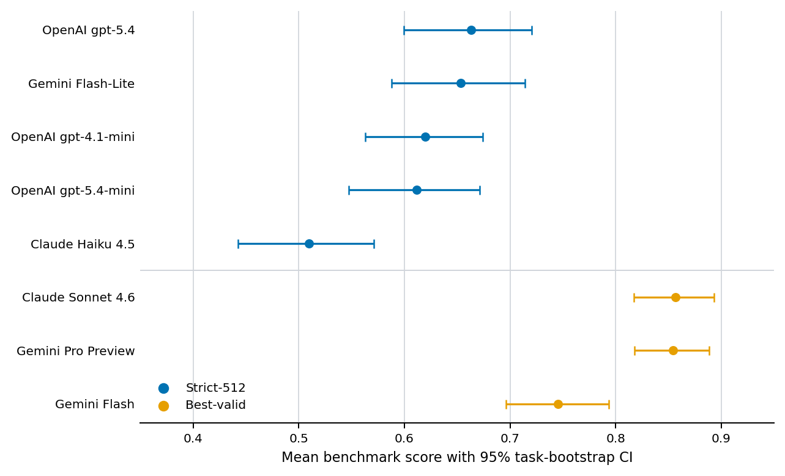
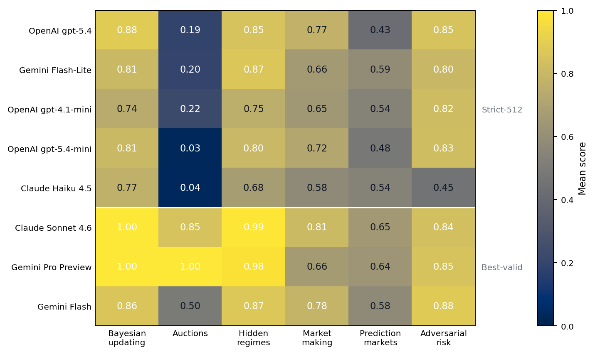
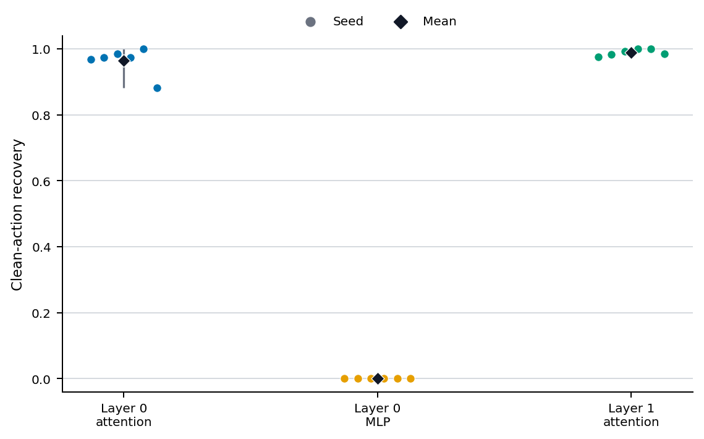
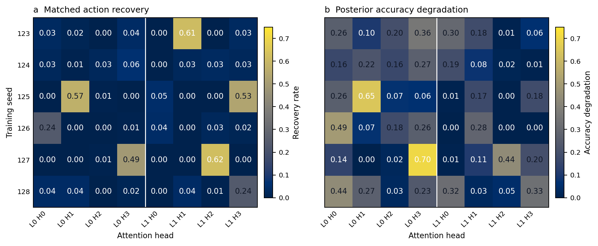

# MimirBench

MimirBench evaluates strategic reasoning under uncertainty in six deterministic environments and analyses a compact transformer trained on a controlled Bayesian and risk task.

## Research question

Can language-model agents update beliefs, make expected-value decisions, respect explicit risk constraints and remain stable under strategic or adversarial pressure? MimirBench tests these capabilities in six deterministic synthetic environments with exact graders. It also trains a compact transformer on a controlled Bayesian and risk task, then uses causal interventions to locate the learned evidence-to-decision computation.

## Main empirical finding

Hosted models exhibit materially different profiles across Bayesian reasoning, auctions, hidden regimes, market making, prediction markets and adversarial risk. No model has a universal advantage across environments. In a separate controlled experiment, a medium synthetic transformer learns the Bayesian and risk task to near-ceiling accuracy across six independently trained seeds. Causal patching consistently localises action recovery to attention sub-blocks, while head and token-position interventions show that the computation is distributed rather than a single-head circuit.

<p align="center">
  
</p>

## Benchmark results

| Model | Track | Mean score (95% CI) | Pass rate | Risk violations |
| --- | --- | ---: | ---: | ---: |
| OpenAI gpt-5.4 | strict-512 | 0.6630 [0.5997, 0.7203] | 0.4250 | 0.0333 |
| Gemini Flash-Lite | strict-512 | 0.6535 [0.5879, 0.7144] | 0.4000 | 0.0417 |
| OpenAI gpt-4.1-mini | strict-512 | 0.6196 [0.5630, 0.6744] | 0.3417 | 0.0250 |
| OpenAI gpt-5.4-mini | strict-512 | 0.6114 [0.5471, 0.6714] | 0.3333 | 0.0167 |
| Claude Haiku 4.5 | strict-512 | 0.5096 [0.4428, 0.5712] | 0.2167 | 0.1250 |
| Claude Sonnet 4.6 | best-valid | 0.8567 [0.8173, 0.8930] | 0.7833 | 0.0000 |
| Gemini Pro Preview | best-valid | 0.8545 [0.8178, 0.8884] | 0.7833 | 0.0000 |
| Gemini Flash | best-valid | 0.7454 [0.6965, 0.7936] | 0.4417 | 0.0083 |

Each row contains 120 tasks, with 20 tasks per environment on the shared seed-123 schedule. The strict-512 track fixes the output budget at 512 tokens while retaining provider-compatible decoding settings. Best-valid rows use the minimum provider-specific settings needed for valid structured output, so cross-track comparisons mix model capability with protocol. The environment results are heterogeneous: Gemini Flash leads adversarial risk, Gemini Pro Preview leads auctions and narrowly leads Bayesian updating, while Claude Sonnet leads hidden regimes, market making and prediction markets. Task-aligned differences and intervals are retained in the [selected benchmark summary](experiments/selected_results/benchmark/summary.json).

<p align="center">
  
</p>

The heatmap groups the five strict-512 rows above the divider and the three best-valid rows below it. It shows why an overall ranking is incomplete: Bayesian and hidden-regime scores are generally strong, while auction and prediction-market performance separates the systems more sharply.

## Strategic environments

| Environment | Capability tested |
| --- | --- |
| Bayesian updating | posterior inference and calibrated action |
| Auctions | strategic bidding and winner's-curse control |
| Hidden regimes | latent-state inference under noisy evidence |
| Market making | inventory-aware decisions under explicit limits |
| Prediction markets | belief, price and edge separation |
| Adversarial risk | constraint adherence under pressure |

## Mechanistic interpretability

The model-organism experiment uses independently trained checkpoints for seeds 123 to 128. Mean held-out action accuracy is `0.9999`, posterior-bucket accuracy is `0.9906`, layer-0 attention action recovery is `0.9635`, layer-0 MLP recovery is `0.0000` for every seed, and layer-1 attention recovery is `0.9891`. A matched donor recovers the action at `0.9635`, compared with `0.4955` for a mismatched donor. The action probe scores `1.0000` with real labels and `0.4714` after label shuffling.

<p align="center">
  
</p>

The attention sub-block result replicates across all six checkpoints. The best mean single-head action recovery is `0.1409` (layer 1, head 3), the strongest mean per-head posterior-accuracy degradation is `0.3138` (layer 0, head 3), and the maximum mean individual-position action recovery is `0.0014`. The leading head changes across all six seeds.

<p align="center">
  
</p>

Across six independently trained checkpoints, attention sub-block interventions consistently restore corrupted decisions, but finer interventions indicate a distributed computation across heads and positions rather than a compact single-head circuit. These causal results concern the trained synthetic model organism, not hosted-model internals.

## Methodology

MimirBench generates deterministic synthetic tasks and grades structured answers with exact environment-specific rules. Hosted-model comparisons use shared task IDs and seeds where paired differences are reported. Confidence intervals are 95% percentile intervals from 2,000 task-level bootstrap resamples with seed 20260606. The mechanistic study trains a 321,455-parameter, two-layer transformer on 12,000 traces per seed and evaluates it on 2,000 held-out traces. Clean and corrupted counterfactual pairs support whole-block, head and position patching, with mismatched-donor and shuffled-label controls across six independent training seeds.

## Reproducibility

Python 3.11 or 3.12 is required. From a clean clone:

```bash
python -m venv .venv
python -m pip install --upgrade pip
python -m pip install -e ".[dev,ml,plots]"
python -m pytest -q
python -m ruff check .
python -m mypy mimirbench tests
```

Verify all committed aggregates and hashes, then generate PNG and PDF figures under `build/figures/` without network calls:

```bash
python scripts/reproduce_results.py
python scripts/plot_results.py
```

Use `python scripts/plot_results.py --publication` only when intentionally updating the tracked publication figures.

The selected results contain numeric task records and aggregate causal evidence only. They contain no prompts, model responses or provider logs. Full hosted-model configurations are retained under `configs/benchmark/`; running them requires explicit provider access and is not part of local reproduction.

## Repository structure

```text
mimirbench/                     benchmark, agents, training and interpretability
configs/                        benchmark, training and causal-analysis configurations
experiments/selected_results/  committed empirical summaries and provenance
figures/                        publication figures in PNG and vector PDF formats
scripts/                        result verification and figure reproduction
tests/                          deterministic tests and fixtures
```

## Citation

```bibtex
@misc{naik2026mimirbench,
  author = {Anannye Naik},
  title = {MimirBench: Strategic Reasoning Evaluation under Uncertainty},
  year = {2026},
  url = {https://github.com/anannyenaik/MimirBench}
}
```

## Licence

MimirBench is released under the [MIT Licence](LICENSE).
